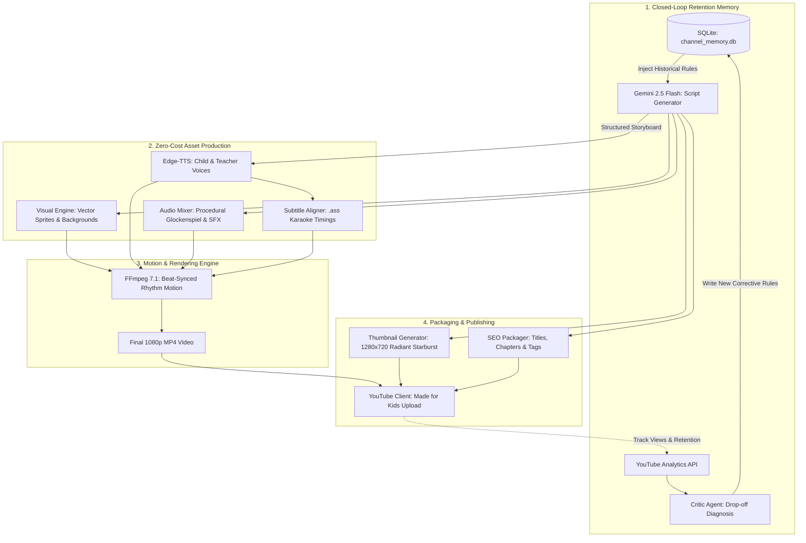

<div align="center">

# 🎬 YouTube Kids Automation Studio
### *Autonomous, Zero-Cost, High-Retention Video Production & Self-Correcting Analytics Engine*

[](https://www.python.org/)
[-success.svg)](https://aistudio.google.com/)
[](LICENSE)
[](https://ai.google.dev/)
[](https://github.com/rany2/edge-tts)
[](https://ffmpeg.org/)

<p align="center">
  <b>Generates 1080p Toddler Nursery Rhymes & Sensory Videos with AI Scripting, Broadcast Voiceover, Beat-Synced Rhythm Motion, Burned Karaoke Subtitles, High-CTR Thumbnails, and a Closed-Loop Retention Feedback Loop.</b>
</p>

</div>

---

## 📌 System Architecture



---

## ✨ Key Features

### 1. 100% Zero-Cost Operation
- **Google Gemini 2.5 Flash:** Free tier (up to 15 RPM via Google AI Studio) for researching topics, writing strict AABB rhyming poems, and structuring scene timelines.
- **Edge Neural TTS:** Crystal-clear studio-grade narration at zero cost (`en-US-AnaNeural` for cheerful child, `en-US-EmmaNeural` for gentle teacher).
- **Procedural Audio & SFX:** Mathematically synthesized glockenspiel nursery melodies and cartoon sound effects (boings, pops, whooshes, giggles) with zero copyright risks.
- **Bundled FFmpeg 7.1:** Includes precompiled FFmpeg binaries inside the environment (`imageio-ffmpeg`) — no manual path configuration or software installations required.

### 2. 2.5D Sensory Rhythm Motion & Karaoke Subtitles
- **Beat-Synced Bouncing:** Characters dynamically bounce and scale to the music tempo ($y = y_0 - h \cdot |\sin(2\pi \cdot \text{BPM}/60 \cdot t)|$) to maintain toddler attention.
- **Dynamic Karaoke Subtitles:** Advanced SubStation Alpha (`.ass`) formatting with bright yellow active-word emphasis and bold cartoon outlines.
- **High-Contrast Backgrounds:** Vibrant sunny skies, rainbow meadows, starry nights, and pastel bubble parties.

### 3. The Self-Optimizing Feedback Loop
- **SQLite Performance Memory:** Videos, views, CTR, and retention at 0:15s, 1:00m, and 3:00m are tracked in `data/channel_memory.db`.
- **The Critic Agent:** Diagnoses where viewers dropped off (e.g. *"First 15s retention < 65% → Deliver visual transformation within 4 seconds"*).
- **Dynamic Rule Injection:** Automatically updates channel rules, which are injected into the system prompt for every subsequent video generation.

---

## 📂 Project Structure

```
kids_youtube_automation/
├── config/
│   └── settings.py          # Paths, voice models, FFmpeg resolution, IPv4 DNS patch
├── core/
│   ├── script_generator.py  # Gemini prompt orchestrator with feedback rule injection
│   ├── voice_synthesizer.py # edge-tts neural voice synthesizer with retry logic
│   ├── subtitle_aligner.py  # Word-level karaoke .ass subtitle generator
│   ├── visual_engine.py     # High-saturation backgrounds & cute cartoon vector sprites
│   ├── audio_mixer.py       # Procedural nursery melody & cartoon SFX generator
│   ├── video_renderer.py    # FFmpeg beat-synced motion & scene assembly engine
│   ├── thumbnail_generator.py # High-CTR 1280x720 radiant thumbnail builder
│   ├── seo_packager.py      # Title, description, chapters, and tags generator
│   ├── youtube_client.py    # YouTube Data API upload & Analytics API client
│   └── feedback_critic.py   # Drop-off analysis & prompt mutation agent
├── assets/
│   ├── sprites/             # Transparent PNG character sprites
│   └── audio/               # Background tracks & SFX (.wav)
├── data/
│   └── channel_memory.db    # SQLite memory of videos and learned rules
├── output/                  # Generated MP4 videos, thumbnails, and SEO packages
├── tests/
│   └── test_pipeline.py     # Automated unit test suite
├── main.py                  # Master CLI interface
├── requirements.txt         # Python dependencies
└── .gitignore               # Security rules (protects credentials and local DBs)
```

---

## 🚀 Installation & Setup

### Prerequisites
- Python 3.10+ installed on your system.

### 1. Clone & Setup Environment
```bash
git clone https://github.com/satroid/Youtube_automation.git
cd Youtube_automation

# Create virtual environment
python -m venv .venv

# Activate virtual environment
# On Windows PowerShell:
.\.venv\Scripts\Activate.ps1
# On Linux / macOS:
source .venv/bin/activate

# Install dependencies
pip install -r requirements.txt
```

### 2. Configure Free Gemini API Key (Optional but Recommended)
Get a free API key at [aistudio.google.com](https://aistudio.google.com/) and create a `.env` file in the project root:
```env
GEMINI_API_KEY="your-gemini-api-key-here"
```
*(If omitted, the service automatically uses its intelligent built-in nursery rhyme fallback engine).*

### 3. YouTube API Setup (Optional for Uploads)
1. In the [Google Cloud Console](https://console.cloud.google.com/), enable the **YouTube Data API v3** and **YouTube Analytics API**.
2. Create an **OAuth 2.0 Client ID** (Desktop Application) and download `client_secret.json` into the project root.
*(If omitted, the service runs in local simulation mode).*

---

## 🎮 Command Line Interface (CLI)

### 1. Generate Full Video, Thumbnail & SEO Package
```bash
python main.py create --topic "Dancing Animals & Sounds" --duration 2
```
*Creates a 1080p MP4 video with animated scenes, voice narration, backing music, karaoke subtitles, a 1280x720 high-CTR thumbnail, and full YouTube SEO metadata with chapters.*

### 2. Render a Quick Demonstration
```bash
python main.py render-sample
```
*Renders a 30-second sensory demonstration to verify audio-video sync and motion performance.*

### 3. Run Analytics Feedback & Retention Critic
```bash
python main.py analyze --video-id sample_kids_001
```
*Evaluates view counts, CTR, and drop-off points, then derives new prompt rules saved directly into `channel_memory.db`.*

### 4. View Active Learned Retention Rules
```bash
python main.py rules
```
*Displays all active retention rules currently injected into Gemini prompts.*

### 5. Run Automated Test Suite
```bash
python -m unittest tests/test_pipeline.py
```

---

## 🛡️ License

This project is open-source and available under the [MIT License](LICENSE).